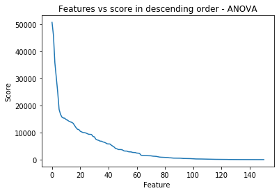

# Motivation

Fraud risk is everywhere. One major sector affected by fraud risk is the e-commerce industry. Online payment service companies are able to collect a vast amount of data on individuals and their transactions and use modeling to distinguish between fraudulent and non-fraudulent behaviors. In order to build our modeling skills and explore the field of fraud detection, we are applying machine learning to detect online payment frauds in a e-commerce transaction dataset from IEEE Computational Intelligence Society (IEEE-CIS) and payment service company, Vesta Corporation.

# Data & Preprocessing

The dataset [[1]](https://www.kaggle.com/c/ieee-fraud-detection/data) provided by Vesta includes identification and transaction data on a series of online payments. The data contains the following unmasked features.

Table 1: Unmasked Features

| Feature Name  | Description 
| ------------- | ------------- 
| TransactionDT | timedelta from a given reference datetime
| TransactionAMT | transaction payment amount in USD
| ProductCD | product code for each transaction
| addr | address of purchaser
| P_emaildomain | purchaser's email
| R_recipientdomain | recipient's email
| DeviceType | desktop or mobile
| DeviceInfo | specific machine (e.g. MacBook)

The meaning of the following features are masked but Vesta has provided the following high level descriptions about the feature categories. Note the examples below are for illustrative purposes only and these specific features may not exist in the data.

Table 2: Masked Features

| Feature Category  | Description 
| ------------------- | ------------- 
| id12 - id38| identities, such as network connection, digital signature, etc.
| card1 - card6 | payment card information, such as card type, card category, issue bank, etc.
| dist | distance between 2 masked locations
| C1-C14 | counting, such as how many addresses are found to be associated with the payment card, etc.
| D1-D15 | timedelta, such as days between previous transaction, etc.
| M1-M9 | match, such as names on card and address, etc.
| Vxxx | Vesta engineered rich features, including ranking, counting, and other entity relations

## Missing Data

All except 20 features have some missing values. We drop features where 90-100% of the values are missing. Since our dataset is so large and most of our features are masked, we decide to not pursue any complex data imputation techniques. For models that can't handle missing values such as logistic regression, we fill NAs with 0s. For models that can handle missing values such as XGBoost, we experiment with leaving missing values as is and filling missing values with -999. -999 is well outside the range of typical values and we believe that the model will be able to distinguish these values as missing and ignore them. 

## Multicollinearity

Many of our features are derived from each other so our predictors are highly multicollinear. Because we want to extract feature importance from our models, we need to reduce multicollinearity. Since the Vxxx features are engineered features and not actual data, we drop one of every two highly correlated features (e.g. correlation > 0.75 or correlation < -0.75). We also drop the feature with fewer number of unqiue values, the intuition being that the feature with greater number of unqiue values contains more "granular" data. 

Although non-Vxxx features (features that are not the Vxxx features) are also multicolinear, we are hesitant to drop them. The non-Vxxx features represent actual data that might be useful in distinguishing between fraud and non-fraud. We experiment with two versions of the data, one with all non-Vxxx columns included and another with multicollinear non-Vxxx columns dropped.

Figure 1: C features correlation matrix

## Feature Engineering

Our dataset is at the transaction level and our models try to find patterns that distinguish fraudulent behavior from normal behavior. However, fraudulent behavior might differ for each user and one user's fradulent behavior may be another user's normal behavior. We want to identify a unique user id and see how rare or common a transaction is for that specific user. Adding features that represent user level statistics (i.e. mean, standard deviation) can help our model find those patterns. This method of feature engineering is common in LGBMs (Light Gradient Boosting Machine) and is discussed in detail by Chris Deotte [[2]](https://www.kaggle.com/c/ieee-fraud-detection/discussion/108575#latest-641841). 

The dataset does not provide a unique user id, so we identify 3 possible combinations of features that could be unqiue to each user: ([card1], [card1 and addr1], [card1, addr1 and P_emaildomain]). Then for each possible unique id, we add user level mean and standard deviation for TransactionAmt, D9, and D11. Our engineered features closely resemble the strategy detailed by Konstantin Yakovlev [[3]](https://www.kaggle.com/kyakovlev/ieee-fe-with-some-eda).

After addressing missing values, multicolinearity, and feature engineering we have the following datasets:

Table 3: Different Datasets

|        | keeping all non-Vxxx features | dropping multicollinear non-Vxxx features |
| -------------  | -------------  | ------------- |
| keeping NA values | X1 | X2
| filling NA values | X3 | X4

# Methodology

## Hyperparamter Tuning and Model Selection
To perform the fraud detection task, we experiment with two different types of classification approaches, including regression and tree-based methods. In order to prevent data leakage and optimistic estimates of model performance, we implement nested cross-validation (CV). Nested CV consists of two nested loops in which the inner loop is used to find the best set of hyperparameters for each candidate model and the outer loop is used to select the best model [[5]](https://www.oreilly.com/library/view/evaluating-machine-learning/9781492048756/ch04.html). Due to the complexity, computational power and financial limitation, we decide to perform hold-out sample approach instead of cross-validation.

Figure 2 shows the detailed nested validation approach. In the outer loop, training data is divided randomly into dataset A and B. Dataset B is hold out for model selection while dataset A enter the inner loop for parameter tuning. Parameter tuning is performed independently for each model. Dataset A is partitioned randomly into dataset C and D. Different sets of hyperparameters are applied on dataset C and evaluated on dataset D. The inner loop outputs the best hyperparameter setting for the model. The next step is to train a new model on the entire dataset A under the best hyperparameter setting. This model is then applied on the holdout dataset B to obtain validation performance. Comparison of different models with their best hyperparameter settings on holdout dataset B yields the best model. Eventually, the final best model is trained using all training data available (A&B) under its best hyperparamter setting. Results of classifying testing data using the final best model is submitted on Kaggle.

Figure 2. Nested Validation Methodology Diagram

## Parameter Optimization

Given the number of features and complexity of some machine learning methods we employ, hyperparameter tuning can be computationally and financially expensive. We have to priortize parameters to be tuned and outline a resonable search space. We use the Bayesian optimization algorithm in the Scikit-optimize module for model tuning. After each iteration, the algorithm makes an educated guess on which set of hyperparameters is most likely to improve the model performance. These guesses are based on the algorithm's statistical estimations on probability, expected score improvement and lower confidence bound. Comparing to commonly known methods like Grid Search and Randomized Search, Bayesian optimization search achieves a lower run-time with relatively good performance.

## Model Performance Metrics
Fraud detection is a highly imbalanced classification problem in which amount of non-fraudulent data outnumbers one of fraudulent data. In this project, area under receiving operating characteristic curve (AUC-ROC score) is used to evaluate model performance. Higher AUC-ROC score indicates better model at distinguishing between fraud and non-fraud transactions. A perfect model would have an AUC-ROC score of 1, which implies that true positive rate is at 100% with false positive rate is at 0%, when all fradulent and non-fraudlent transactions are correct classified.

# Experiments

## Approach 1: Regression Methods
We first experiment with a simple logisitic regression model to serve as a performance baseline, as we explore more complex methods.

### Logistic Regression

Logistic regression is named for the function used at the core of the method, the logistic function. The logistic function is an S-shaped curve that can take any real-valued number and map it into a value between 0 and 1, but never exactly at those limits.

Figure 3. Sigmoid curve

Logistic regression is a linear method, but the predictions are transformed using the logistic function. The model can be stated can be written as:

Thus the odds can be expressed as a linear combination of the predictor variables. Logistic regression models the probability of the default class, here the probability of fraud.

### Dealing with class imbalance

Logistic Regression is designed for problems that assume an equal distribution of classes. Our dataset constitutes of 3.5% fraudulent transactions (Figure 4). If we feed the orginial dataset into logistic regression model, the algorithm may neglect the examples from the minority or fraudulent class, which is against the objective of our analysis.

We can address this problem by data resampling to balance the class distribution. Once balanced, standard logistic regression can be trained directly on the transformed dataset without any modifications.

Figure 4. Distribution of response variable in our dataset

There are two ways to balance data:

1. _Oversampling_ : Duplication or replication of examples from minority class
2. _Undersampling_ : Restrained choosing of examples from the majority class

Random oversampling increases the likelihood of overfitting for the minority class as we are making exact replications of minority class examples. Oversampling can also introduce bias in the model as the model gets restrained by samples in the training set, lowering its ability to generalize to a standard dataset [[6]](https://machinelearningmastery.com/random-oversampling-and-undersampling-for-imbalanced-classification/).

Hence we decide to perform undersampling. There are different ways to perform undersampling:

### Random undersampling

This involves randomly selecting examples from the majority class to remove from the training set. This reduces the ratio of the majority class in the training set. This process can be repeated until we have a more balanced ratio of samples for each class. 

We implemented this technique by randomly selecting data points in the non-fraud class using the RandomUndersampler from the imbalanced-learn module. The number of data points selected is equal to the number of data points in the fraud class, feeding a balanced distribution to the classifier.

### Clustered undersampling
Clustered undersampling involves clustering samples of the majority class, then by selecting samples from each cluster, we can obtain a sample of the majority class that is more respresentative of the population. We set the number of clusters to be equal to the number of data points in the minority class. The cluster centers extracted using K-Medoids are the samples of the majority class selected to be included in the training set.

We first perform inferential feature selection to reduce computational complexity of clustering high dimensional data.

#### Feature selection (Chi-Squared/ ANOVA tests)
Inferential feature selection aims to select variables which are highly dependent on the response variable. In our case, the response variable is categorical. Numeric and categorical predicting variables must be handled differently due to difference in the type of distributions.

**Chi-squared Test**

For categorical variables, we performed Chi-squared test [[7]](https://machinelearningmastery.com/feature-selection-with-real-and-categorical-data/). 
A Chi-Squared test is used in statistics to test the independence of two events. Given the data of two variables, we can get observed count O and expected count E. Chi-Squared value measures how expected count E and observed count O deviates each other.

Figure 5. Chi-Squared Test formula

When two features are independent, the observed count is close to the expected count, thus we will have smaller Chi-Square value. So high Chi-Squared value indicates that the hypothesis of independence is incorrect or the feature is more dependent on the response. Hence, features with high Chi-Squared values are selected for model training.

We choose variables until there is a sudden dip in the Chi-Squared scores.

Figure 6. Chi-Square values for the features in descending order

**ANOVA Test**

Analysis of Variance is a statistical method, used to check the means of two or more groups that are significantly different from each other. It uses the F distribution.
It assumes the following hypothesis:

    H0: The 2 means are equal
    H1: At least one mean of the groups are different.

The f-score gives us an idea if there is a variance between the 2 groups of fraud and non fraud explained by that particular numeric variable. A higher F-score indicates the variable is important. Variables are selected until there is a sudden dip in the F score.

Figure 7. F values for the features in descending order

Once number of features is reduced, we then implement clustering using KMediods.

#### Clustering by K-medoids

The K-means clustering algorithm is sensitive to outliers, because a mean is easily influenced by extreme values. K-medoids clustering is a variant of K-means that is more robust to noises and outliers. Instead of using the mean point as the center of a cluster, K-medoids uses an actual point in the cluster to represent it. Medoid is the most centrally located point of the cluster, with minimum sum of distances to other points. 
 
 
Figure 8. Difference between K-means and K-medoids

### Result
Using logistic regression, balanced dataset outperforms imbalanced one. Additionally, cluster-undersampled dataset results in better ROC-AUC score than random undersampled one. However, we could perform this test only on a portion of the dataset as we do not have enough computational resources to cluster the entire dataset with over 600 features columns. In conclusion, we perform random undersampling of non-fraud data to create a balanced dataset for logistic regression. Other models described below skip data balancing as they inherently account for the imbalanced dataset. 

We implemented logistic regression using LogisticRegressionClassifier in the sklearn module, on both X3 and X4 dataset. We observed that the logistic regression performed on X3 slightly better than on X4 dataset with AUC-ROC score of 0.8651 and 0.8588 respectively. This is expected as X3 has more features than X4, resulting in higher predictive power. Regarding to feature importance, both dataset show relatively similar results. 

## Approach 2: Tree Based Methods
Compared to logistic regression, tree based methods are less susceptible to outliers and make fewer assumptions about the underlying structure of our data. So, in addition to logistic regression, we try tree based bagging and boosting methods including Random Forest, LGBM and XGBoost. 

Figure 9. Bagging vs Boosting methods

### 2.1 Random Forest

The most basic tree based model is Decision Tree - a single tree algorithm which is commonly refered as Classification and Regression Trees (CART). A decision tree is a flowchart like tree structure, in which each internal node denotes a test on an attribute, each branch represents an outcome of the test, and each leaf node (terminal node) represents a class label. The paths from root to leaf represent classification rules. Decision at each node is made such that it maximizes the information gain or minimizes the total entropy. The decision tree is susceptible to overfitting and hence requires pruning. However, pruned decision tree is still sentitive to high variance and instability in predicting test data. To resolve this issue, bagging decision tree model is introduced where it combines multiple decision trees. 

Random forest is identical to bagging decision tree except it adds additional randomness to the model. While splitting a node, instead of searching for the most important feature among all features, it searches for the best feature among a random subset of features. This results in a wide diversity that generally results in a better model.

We implemented random forest using RandomForestClassifier in the sklearn module, on both X3 and X4 dataset. We observed that random forest performed on X3 slightly better than on X4 dataset with AUC-ROC score of *0.955* and *0.947* respectively. This is expected as X3 has more features than X4, resulting in higher predictive power. Regarding to feature importance, both dataset show relatively similar results. Although the relative order of frature importance changes sligtly, the same features showe high importance such as "D1", "C13", "TransactionAMT_car1_addr1_mean", "C1", "D15", etc. See Figure 12.

Figure 10. Tree building methods of LGBM and XGBoost

 
### 2.2 LGBM

LightGBM is a gradient boosting framework that uses tree-based learning by growing tress horizontally, leaf wise choosing the leaf with the maximum delta. This can help reduce more loss than a level wise algorithm. The unique feature of LGBM model is that it uses **Gradient-based One-Side Sampling (GOSS)**, that splits the samples based on the largest gradients and some random samples with smaller gradients. The underlying assumption is that the data points with smaller gradients are more well-trained. Another key feature is the **Exclusive Feature Bundling (EFB)**, which investigates the sparsity of features and combines multiple features into one. It is assumed that no information loss happens, and the features are never non-zero together. These make LightGBM a speedier option compared to XGBoost.

LGBM can handle large size of data and takes relatively lower memory to run, though it can result in overfitting for a small dataset. The LGBM classifier is becoming increasing popular because of its low memory usage and faster computational speed. It was first introduced by Microsoft in 2017 [4] and since then it has become a de-facto algorithm for multiple Kaggle competitions.

We used the sklearn LGBMClassifier function to implement the model. Training the tuned LGBM model on both X1 and X2 dataset, we achieved a validation AUC score of *0.9695* and *0.9673* respectively. We also see that the most important features are "D1", "D15", and "D10".

### 2.3 XGBoost

XGBoost is a gradient boosted decision tree algorithm designed for speed and robust performance, that is known for exceptional performance in binary classification problems with a severe class imbalance. 

Similar to other methods discussed above, XGBoost is a collection of decision trees, build sequentially to minimize the specified objective function using gradient descent. The objective function consist of a loss function and regularization term that controls predictive power and simplicity of the model respectively. A major difference that differentiates XGBoost from random forest is that XGBoost can handle missing values in the data. In each split, the model evalutes the maximum gain of allocating all data points with missing value to the left subnode versus that of the right subnode, hence assign a direction for all missing values. This atttribute brings about more convenience, as users can set up a model without imputating values or giving up model features to handle missing data. However, in practice, imputing data may improve performance of the model, especially when the quality of the dataset is low. 

To accelerate our model training and evaluation process, we employed a few tactics:
- **Using a histogram based algorthim for splitting.**
This method group features into a set of bins and perform splitting on the bins instead of individual features. This reduces the computational complexity of computing each best split from from O(#data * #features) to O(#data * #bins).
- **Passed in the parameter "scale_pos_weight".**
This is a ratio between positive samples and negative samples calculated from the dataset that helps convergence.
- **Train on cloud.**
We set up an AWS EC2 instance with GPU to train the model. This allows us to take advantage of the GPU histogram estimator and GPU predictor functions in the XGBoost module. Taking our base model as an example, this successfully decreases the training time from 58 minutes to under 3 minutes (95% decrease), and the prediction time from 2 minutes to under 8 seconds(93% decrease).

Training the tuned XGBoost model on both X1 and X2 dataset, we achieved a validation AUC score of *0.9747* and *0.9739* respectively, higher than other models. Unlike other models, XGBoost uses "V258" as a dominant feature for predictions. As "V258" is a feature engineered by Vesta, we unfortunately cannot make any further inferences.

Table 4. Ranked listing of hyperparameters tuned for Random Forest, LGBM and XGBoost

| Hyperparameters  | Impact on model | Importance |Tuned in RF|Tuned in LGBM|Tuned in XGBoost|
| ------------- | ------------- |:-------------: | :-------------: | :-------------:|:-------------: |
| Number of iterations | Higher value increases complexity of the model, making the model more likely to overfit.| High|X|X|X|
|Learning rate| Impacts the duration needed for the model to converge and performance of the model. | High||X|X|
|Maximum depth| Maximum depth of each trained tree. Higher value increases complexity of the model, making the model more likely to overfit. | High|X|X|X|
|Column sampling by tree| % of columns used per iteration. Lower value means that each tree can only consider a smaller proportion of total columns. This avoids some columns to take too much credit for the prediction. | High||X|X|
|Row sampling| % of rows used per iteration. Higher value prevents overfitting, but potentially in sacrifice of performance. | Medium||X|X|
|Hessian Regularization| Prune by minimum sum of instance weight needed in a child. | Medium||X||
|Minimum data per leaf| Prune by minimum number of observations required. | Medium||X||
|Maximum leaves| Maximum leaves for each trained tree. |Medium||X||
|L1 Regularization| L1 Regularization for Boosting. |Medium||X||
|L2 Regularization| L2 Regularization for Boosting. |Medium||X||
|Loss regularization| Minimum reduction in the loss function required to make a split. Values can vary based on the loss function.| Medium|||X|
Maximum features|Number of features when looking for the best split. Lower value adds for randomness and avoids columns to take too much credit for prediction. |Medium|X|||
Class weight| Weights associated with classes in the form {class_label: weight}.|Medium|X|||

# Results & Discussion 

Overall, the XGBoost model using feature set X1 has the best AUC score performance (0.9747) amongst all models (Figure 11). The model is trained on the complete training set and used to predict probabilities of fraudulent transaction in the test set. Our test AUC score is satisfactory (0.9374), placing us as one of the top 100 teams out of 6200 submissions if the Kaggle competition was still opened.

Figure 11. ROC curve of all models

Table 5. Results of all models

|  | Logistic Regression | Random Forest | LGBM | XGBoost |
| ------------- | ------------- | ------------- | ------------- | ------------- |
| Parameters Used| C=10, max_iter=17004, penalty='l2', solver='saga  | n_estimators = 931, max_depth = 32, max_features = 'log2', class_weight = 'balanced'| n_estimators = 607, max_depth = 481, learning_rate = 0.164, colsample_bytree = 0.760, subsample = 0.742, min_child_weight = 1.018, min_data_in_leaf = 120, num_leaves 615, reg_alpha = 3, reg_lambda = 878| n_estimators = 200, max_depth = 12, learning_rate = 0.126, colsample_bytree = 0.8, subsample = 1, gamma = 0, scale_pos_weight = 5.26, tree_method='gpu_hist', eval_metric='auc', objective='binary:logistic'|
| Training AUC Score|  0.8708 |0.9669 | 0.9650 |1.0000|
| Validation AUC Score| 0.8651  | 0.9546 |0.9695 |0.9747|
| Training Time`| 3600 secs | 2700 secs | 623 secs| 200 secs*|
| Prediction Time`| 120 secs | 600 secs | 96 secs |32 secs|

`Note that models are trained on different devcies and these efficiency metrics are not directly comparable.

*On CPU-only machine for better comparison, model training, prediction and parameter tuning is done on cloud instance with GPU

Figure 12 shows the top 60 features that are found to be most important across models. Different models are using different set of features for prediction. Some interesting insights include:

**1. XGBoost uses a smaller subset of features as compared to other models.**

Logistic regression uses the highest number of features, followed by random forest and LGBM. These three algorithms use different construction methods, therefore the three models handle correlated features in the dataset differently. Taking correlated features f1 and f2 as an example, with f1 being the more useful feature that generates a higher information gain. XGBoost builds trees sequentially such that each subsequent tree aims to reduce the errors of the previous tree. Majority of XGBoost trees will correct their predecessors' mistake and split on feature f1 with more information gain. LGBM uses gradient based one side sampling, a leaf-wise growing method with results similar to XGBoost's level-wise tree growing method if the full tree is grown, and is more likely to split on feature f1 as well. In random forest, each tree is independent. With bootstrap sampling, likelihood for each tree to split on f1 and f2 can be similar. Therefore some trees might split on f1 while the others split on f2. This explains why random forest uses a higher number of features while each feature has lower feature importance. In fact, for many of the top 20 features, feature importance of LGBM is double that of random forest. A possible explanation is that these features highly correlate with other features, and that those features are included in the random forest model but not the LGBM model.

Models that use a smaller set of features have some key advantages, including high interpretability and low computational cost. This gives the XGBoost model an extra edge, however, we can always experiment with regularization parameters of the other models to limit the feature set used.

**2. User-level features are found to be helpful in 2 out of 4 models.**

Random forest and LGBM models have a similar feature set, that includes many engineered features that identify individual users, such as "card1_addr1_Pf_emaildomain" and "card1_addr1". This confirms our earlier hypothesis that fraudulent behavior can look different for individual users. By identifying the average behavior of a user, we can understand if a partiular transaction is dissimilar to the users' average behavior and estimate how likely the transaction may be fradulent. 

Figure 10. Feature importance across models

# Model Deployment and Post-production Monitoring 

**Determining most suitable threshold**

To deploy the fraud detection model, Vesta has to determine the respective business cost of a false positive (FP) and false negative (FN) prediction. The FP cost is the immediate and long-term loss of potential revenue, results from Vesta rejecting a transaction of a honest user. The FN cost is the chargeback cost or other penalty that Vesta is responsible for approving a fraudulent transaction. Proceeding forward, Vesta can consider two methods of determining a suitable threshold:
1. Apply a suitable threshold on all transactions, reject all transactions above those threshold → Based on the calculated ratio between FP and FN cost, Vesta can find the optimal threshold the minimizes total cost. Any transactions with a probability higher than that threshold can be rejected.
2. Set up different thresholds for transactions with different dolllar amounts → Depends on the pricing structure between Vesta and its vendors, the financial cost of FP and FN predictions might not be consistent across transaction amounts. For instance, fradulent transactions above a certain amount may not be covered by insurance. Vesta can categorized transactions into different bins according to the transaction amount, hence implement different thresholds for each bin. In the earlier example, big transactions might be rejected at a lower threshold (lower predicted probability to be fradulent), as Vesta is exposed to more risk.

**Identify when the data/ pattern changes**

After deploying the fruad detection model, it is important to regularly evaluate model performance to ensure that the model is still relevant and accurate. Continuous model evaluation also drives key managerial decision such as whether or not the model has to be retrained.The first step is to know whether the data can be trusted and whether the observed changes are genuine. This can be gauged by:

- Checking annotations of data → Check distribution of labels, how far is that from the distribution of the training set/ ground truth
- Checking model dependencies → if it relies on features from a package, did that implementation change? (So, if there is a drop in accuracy maybe it is not the input data that changed but the dependency component in the middle)

Once we know the changes are genuine, we can set up systems to track them.

**Types of changes encountered in the data:**

1. Nature of new data different from one its trained on - newer time period, or a newer economic policy or simply data of different nature(newer products or different features of older products, difference in data distributions, etc.)
2. Changes due to a positive feedback loop (e.g revenue estimates from a ML model- If the model results of the past was used to rectify business policies then the model results of the future not relevant anymore)

**How to monitor changes?**

1. Raise alarm if aggregation stats of the incoming data far exceed the the aggregation stats of the data trained (along with a desired threshold bound) indicative of data distribution changes
2. Change detection on accuracy metrics- raise alarm if accuracy falls below a certain threshold 
Track number of false positives and number of false negatives and raise alarm if either crosses a threshold ( which in turn decided by which is costlier) 
3. The metrics monitored should also be reviewed by subject matter experts based on the business, industry acumen and market conditions.

**What can be done to rectify?**

1. Retraining- Sometimes unavoidable but not efficient and not always affordable
2. Weighting data based on its age- new data given more preference
3. Make the model learn the change - Boosting models

# References
1. [https://www.kaggle.com/c/ieee-fraud-detection/data](https://www.kaggle.com/c/ieee-fraud-detection/data)
2. [https://www.kaggle.com/c/ieee-fraud-detection/discussion/108575#latest-641841](https://www.kaggle.com/c/ieee-fraud-detection/discussion/108575#latest-641841)
3. [https://www.kaggle.com/kyakovlev/ieee-fe-with-some-eda](https://www.kaggle.com/kyakovlev/ieee-fe-with-some-eda)
4. Kamil Belkhayat Abou Omar. "XGBoost and LGBM for Porto Seguros Kaggle challenge A comparison. " 2017. pdf.
5. [https://www.oreilly.com/library/view/evaluating-machine-learning/9781492048756/ch04.html](https://www.oreilly.com/library/view/evaluating-machine-learning/9781492048756/ch04.html)
6. [https://machinelearningmastery.com/random-oversampling-and-undersampling-for-imbalanced-classification/](https://machinelearningmastery.com/random-oversampling-and-undersampling-for-imbalanced-classification/)
7. [https://machinelearningmastery.com/feature-selection-with-real-and-categorical-data/](https://machinelearningmastery.com/feature-selection-with-real-and-categorical-data/)
